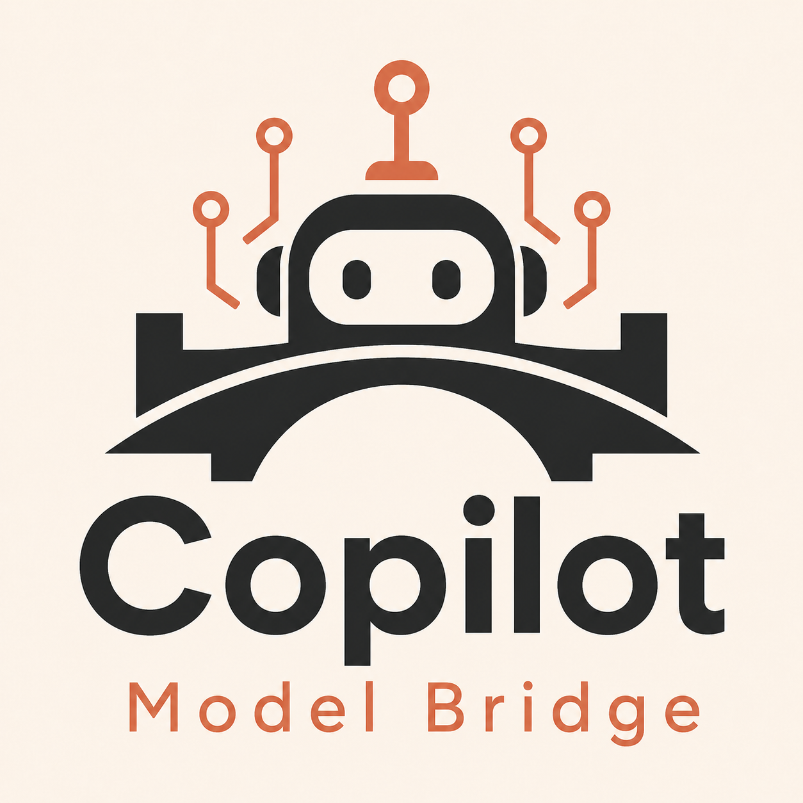
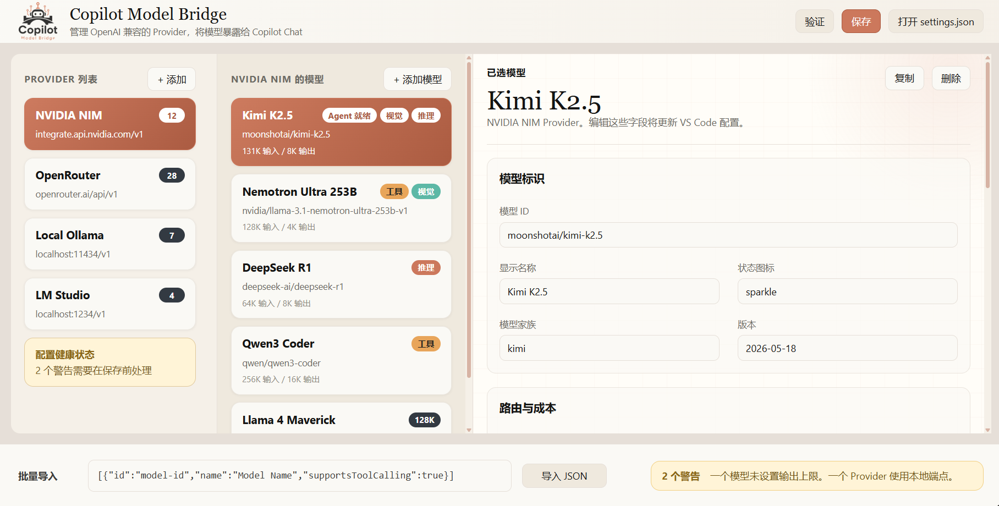

<p align="center">
  
</p>

<h1 align="center">Copilot Model Bridge</h1>

<p align="center">
  把 OpenAI 兼容模型接入 GitHub Copilot Chat 的 VS Code 扩展。
</p>

<p align="center">
  <a href="https://marketplace.visualstudio.com/items?itemName=weisiren.cmb-copilot-model-bridge">
    
  </a>
  
  
  
</p>

<p align="center">
  <a href="docs/README.en.md">English</a>
</p>



Copilot Model Bridge 会把你自己的模型服务注册到 GitHub Copilot Chat 的模型选择器中，让 Ollama、LM Studio、vLLM、NVIDIA NIM、Groq、Grok、OpenRouter、Together AI、DeepSeek、Gemini 兼容网关、Anthropic Messages 兼容服务等模型像内置模型一样使用。

> [!IMPORTANT]
> Marketplace 版本不声明 VS Code proposed API，也不需要 `--enable-proposed-api`。请使用 VS Code `1.115.0` 或更高版本，并确保当前 VS Code / GitHub Copilot 环境允许第三方语言模型 Provider。

## 适合谁

- 想在 Copilot Chat 里使用本地模型、私有网关或自建 OpenAI 兼容服务的开发者
- 想集中管理多个模型服务、多个模型和不同上下文长度配置的用户
- 想测试支持工具调用、视觉输入、reasoning / thinking 输出的模型能力
- 想在 Copilot Chat 体验中复用 BYOK 或内网模型资源的团队

## 核心功能

- **多 Provider 管理**：为每个服务配置独立的名称、Base URL、API Key 和模型列表
- **Chat Completions 模式**：支持 OpenAI 兼容的流式对话服务
- **Responses 模式**：完整处理 Responses 流式文本、推理摘要和函数调用事件
- **OpenAI 官方适配**：内置 Responses API 预设与 GPT-5.6 Sol、Terra、Luna 模型档案
- **Anthropic Messages 模式**：支持 Claude / Anthropic 兼容 `/messages` 协议、工具调用、图片和文档输入
- **Gemini 兼容增强**：优化 Gemini 兼容服务的地址识别、工具声明、思考内容和多轮工具调用体验
- **Grok 兼容增强**：识别 Grok 模型与兼容网关，并按模型能力映射思考强度
- **Reasoning 支持**：支持模型级思考强度选择；宿主开放原生思考部件时直接展示，否则通过稳定 DataPart 保留并回放
- **工具调用能力**：按模型声明稳定的工具调用能力，支持 Agent 模式调用工具
- **多模态开关**：按模型声明图片、视频、文件输入能力；不支持的输入会给出清晰错误
- **可视化配置管理器**：通过 Webview 管理 Provider 和模型，也支持命令面板向导
- **模型元数据**：配置上下文长度、输出上限、模型家族和说明信息

## v1.1.6 更新重点

- 修复 Kimi 在多轮对话和工具调用后思考内容无法继续显示或回放的问题
- 修复 Grok 兼容网关根地址缺少 `/v1` 时请求失败的问题
- 修复无参数工具缺少空对象 Schema 时被部分 Grok 网关拒绝的问题
- 增强 Chat Completions、Responses 和 Anthropic Messages 的思考流结束与多轮衔接

## v1.1.5 更新重点

- 新增 Grok 系列模型和兼容网关支持
- 恢复按模型能力选择思考强度，支持 `none`、`low`、`medium`、`high`、`xhigh` 和 `max` 等档位
- 优化 Chat Completions、Responses 和 Anthropic Messages 的思考内容解析、聚合与多轮回放
- 移除 Marketplace 包对 proposed API 的强制依赖，实验接口不可用时不再影响模型请求

<details>
<summary>v1.1.4 及更早版本</summary>

### v1.1.4 更新重点

- Chat Completions、Responses 和 Anthropic Messages 请求统一上报输入、输出与缓存 Token 用量
- 配置管理器将 Token 限制拆分为上下文窗口、最大输出和自动计算的可用输入，减少配置不一致

### v1.1.3 更新重点

- 新增 GPT-5.6、GPT-5.6 Sol、GPT-5.6 Terra、GPT-5.6 Luna 的 OpenAI 官方模型档案
- OpenAI 官方 Provider 默认使用 Responses API，并支持完整的流式文本、推理摘要和函数调用
- GPT-5.6 Chat Completions 使用 `max_completion_tokens`，允许 reasoning 与 function tools 同时启用
- 正确传递显式 `none` reasoning 档位，不再错误回退到模型默认值
- reasoning 摘要按条目聚合和去重，避免同一段思考内容重复显示
- 清理思考内容中的空 HTML 注释和成对 Markdown 加粗标记，避免残留 `<!-- -->` 或 `**`

### v1.1.2 更新重点

- 重构模型元数据架构：将 VS Code 专属 UI 类型（ThemeIcon）与纯元数据层分离
- 模型分类（category）简化为纯字符串，避免对象引用导致的选择器不稳定
- 状态图标（statusIcon）移至 Provider 模型组装层管理，提升代码内聚性
- 新增 provider.models 层单元测试覆盖

### v1.1.1 更新重点

- 新增 `anthropic` 请求模式，支持 Anthropic Messages API
- 支持 Anthropic 文本、图片、PDF、文本文件、工具调用、工具结果和 thinking 流式事件
- 支持 Anthropic `tool_choice`、`disable_parallel_tool_use`、文档引用和 redacted thinking 往返
- Anthropic 临时故障会按 SDK 风格重试，并保留上游错误类型与 request id
- Anthropic extended thinking 默认只对 Claude 模型 ID 自动发送，兼容网关可用 `anthropicThinkingMode` 显式控制
- 保留 `chat` / `responses` 请求模式选择
- 优化 Gemini 兼容服务的工具调用、思考内容和签名续传体验
- 优化 reasoning 内容在 Copilot Chat 中的展示
- 模型请求输出上限优先使用用户配置值
- 非 Anthropic 临时上游故障提示更友好，避免暴露底层服务内部信息
- 失败请求不再默认写入本地诊断文件，降低敏感内容残留风险

</details>

## 要求

| 项目 | 要求 |
| --- | --- |
| VS Code | `1.115.0` 或更高 |
| GitHub Copilot | 可使用 Copilot Chat 的账号 |
| 模型服务 | OpenAI 兼容流式接口，或支持本扩展可选的 Responses / Anthropic Messages 模式 |

> [!NOTE]
> 不同模型服务对工具调用、reasoning、图片输入和 Responses 模式的支持程度不同。建议先用一个基础文本模型验证连通性，再逐步开启高级能力。

> [!TIP]
> Grok 4.5 推荐使用 `responses` 模式，原生思考强度仅支持 `low`、`medium` 和 `high`，其中 `high` 为最高档位；`xhigh` 和 `max` 不是 Grok 4.5 的原生档位。

> [!NOTE]
> VS Code 自带的 **Custom Endpoint** 已支持 Chat Completions、Responses 和 Messages API。只需连接单个标准端点时可直接使用原生能力；本扩展主要用于集中管理多个 Provider 以及处理兼容网关差异。

## 快速开始

1. 安装扩展，或通过 VSIX 手动安装。
2. 打开命令面板，运行 `Copilot Model Bridge: Open Config Manager`。
3. 新增 Provider，填写 Provider ID、显示名称、Base URL、API Key。
4. 选择请求模式：
   - `chat`：适用于常见 OpenAI 兼容 Chat Completions 服务
   - `responses`：适用于 OpenAI、xAI/Grok 及支持 Responses 风格请求和流式事件的服务
   - `anthropic`：适用于 Anthropic Messages API 或兼容网关
5. 在该 Provider 下新增模型，填写模型 ID、显示名称、输入/输出 token 上限和能力开关。
6. 打开 Copilot Chat，在模型选择器中选择刚添加的模型。

模型会以 `<模型名> (<Provider 名>)` 的形式显示，例如：

```text
Kimi K2.5 (NVIDIA NIM)
```

## 配置示例

推荐使用配置管理器编辑。需要手写配置时，可在 VS Code Settings JSON 中配置 `copilot-model-bridge.providers`。

### 本地 Ollama

```json
{
  "copilot-model-bridge.providers": [
    {
      "id": "ollama-local",
      "displayName": "Ollama",
      "baseUrl": "http://localhost:11434/v1",
      "apiKey": "",
      "apiStyle": "chat",
      "models": [
        {
          "id": "llama3.2",
          "name": "Llama 3.2",
          "maxInputTokens": 32000,
          "maxOutputTokens": 4096,
          "supportsToolCalling": false,
          "supportsVision": false,
          "supportsReasoning": false
        }
      ]
    }
  ]
}
```

### 支持 reasoning 的模型

```json
{
  "id": "reasoning-provider",
  "displayName": "Reasoning Gateway",
  "baseUrl": "https://example.com/v1",
  "apiKey": "YOUR_API_KEY",
  "apiStyle": "chat",
  "models": [
    {
      "id": "reasoning-model",
      "name": "Reasoning Model",
      "maxInputTokens": 128000,
      "maxOutputTokens": 8192,
      "supportsToolCalling": true,
      "supportsReasoning": true,
      "supportedReasoningLevels": ["low", "medium", "high"],
      "defaultReasoningLevel": "medium"
    }
  ]
}
```

### Anthropic Messages / Claude

```json
{
  "id": "anthropic",
  "displayName": "Anthropic",
  "baseUrl": "https://api.anthropic.com/v1",
  "apiKey": "YOUR_API_KEY",
  "apiStyle": "anthropic",
  "models": [
    {
      "id": "claude-sonnet-4-5",
      "name": "Claude Sonnet 4.5",
      "maxInputTokens": 200000,
      "maxOutputTokens": 4096,
      "supportsToolCalling": true,
      "supportsVision": true,
      "supportsReasoning": true,
      "defaultReasoningLevel": "medium",
      "anthropicThinkingDisplay": "summarized"
    }
  ]
}
```

### MiniMax Anthropic 兼容接口

```json
{
  "id": "minimax",
  "displayName": "MiniMax",
  "baseUrl": "https://api.minimax.io/anthropic",
  "apiKey": "YOUR_API_KEY",
  "apiStyle": "anthropic",
  "models": [
    {
      "id": "MiniMax-M3",
      "name": "MiniMax-M3",
      "maxInputTokens": 1000000,
      "maxOutputTokens": 4096,
      "supportsToolCalling": true,
      "supportsVision": true,
      "supportsReasoning": true,
      "anthropicThinkingMode": "enabled"
    }
  ]
}
```

## 常用 Base URL

| 服务 | Base URL |
| --- | --- |
| Ollama | `http://localhost:11434/v1` |
| LM Studio | `http://localhost:1234/v1` |
| NVIDIA NIM | `https://integrate.api.nvidia.com/v1` |
| Groq | `https://api.groq.com/openai/v1` |
| OpenRouter | `https://openrouter.ai/api/v1` |
| Together AI | `https://api.together.xyz/v1` |
| Anthropic | `https://api.anthropic.com/v1` |
| MiniMax Anthropic | `https://api.minimax.io/anthropic` |

## 模型能力字段

| 字段 | 说明 |
| --- | --- |
| `maxInputTokens` | 模型最大输入 token 数 |
| `maxOutputTokens` | 请求发送给上游的最大输出 token 数 |
| `supportsToolCalling` | 是否声明支持工具调用 |
| `supportsEditTools` | 兼容保留字段；稳定 Provider API 暂不暴露编辑工具提示 |
| `preferredEditTools` | 兼容保留字段；等待 VS Code 对应 API 稳定后再启用 |
| `toolChoiceMode` | 工具选择策略：`auto`、`required`、`none`、`omit` |
| `supportsVision` | 是否支持图片输入 |
| `supportsVideo` | 是否声明支持视频附件 |
| `supportsFileInput` | 是否声明支持非图片文件输入 |
| `supportsReasoning` | 是否声明模型支持 reasoning，并向上游发送对应配置 |
| `supportedReasoningLevels` | 可选 reasoning 档位 |
| `defaultReasoningLevel` | 默认 reasoning 档位 |
| `enableDocumentCitations` | Anthropic 文档输入是否请求引用信息 |
| `anthropicThinkingDisplay` | Anthropic thinking 返回方式：`summarized`、`omitted` |
| `anthropicThinkingMode` | Anthropic extended thinking 发送策略：`auto`、`enabled`、`disabled` |
| `disableParallelToolUse` | Anthropic 工具调用是否限制为单工具并行 |
| `multiplier` / `multiplierNumeric` | VS Code 模型 UI 中展示的倍率标签 |

## 常用命令

| 命令 | 用途 |
| --- | --- |
| `Copilot Model Bridge: Open Config Manager` | 打开可视化配置管理器 |
| `Copilot Model Bridge: Quick Manage Providers` | 快速管理 Provider |
| `Copilot Model Bridge: Add Provider` | 新增 Provider |
| `Copilot Model Bridge: Remove Provider` | 删除 Provider |
| `Copilot Model Bridge: Add Model` | 新增模型 |
| `Copilot Model Bridge: Edit Model` | 编辑模型 |
| `Copilot Model Bridge: Duplicate Model` | 复制模型配置 |
| `Copilot Model Bridge: Import Models from JSON` | 从 JSON 导入模型 |
| `Copilot Model Bridge: Validate Provider Config` | 检查配置问题 |
| `Copilot Model Bridge: List Providers` | 查看已配置 Provider 和模型 |

## 手动安装 VSIX

如果你拿到的是 `.vsix` 文件：

1. 打开 VS Code Extensions 视图。
2. 点击右上角 `...`。
3. 选择 `Install from VSIX...`。
4. 选择 `cmb-copilot-model-bridge-1.1.6.vsix`。

也可以使用命令行：

```bash
code --install-extension cmb-copilot-model-bridge-1.1.6.vsix
```

## 排查建议

| 现象 | 建议 |
| --- | --- |
| 模型没有出现在 Copilot Chat | 确认 VS Code 版本、Copilot Chat 可用性，以及第三方语言模型 Provider 能力是否可用 |
| 出现 `CANNOT use API proposal` | 升级到已移除 proposal 依赖的版本并重载 VS Code，不要长期使用 `--enable-proposed-api` 绕过 |
| 请求失败或无响应 | 先检查 Base URL、API Key、模型 ID 和服务是否支持流式响应 |
| Anthropic 兼容接口返回 404/401 | 确认 Base URL 是否已经包含服务要求的前缀，例如 MiniMax 使用 `/anthropic` |
| 工具调用失败 | 关闭 `supportsToolCalling` 验证基础对话，再逐步开启工具调用 |
| 图片或文件输入失败 | 确认模型能力字段和上游服务实际支持范围一致 |
| reasoning 不显示 | 当前宿主未开放原生思考部件时，Copilot Chat 可能只显示正文或工具调用；推理内容仍会保留并用于多轮请求 |

## 本地开发

```bash
npm install
npm run compile
npm test
```

在 VS Code 中打开仓库后按 `F5`，即可启动 Extension Development Host 调试扩展。

常用脚本：

| 脚本 | 说明 |
| --- | --- |
| `npm run compile` | 编译 TypeScript |
| `npm run watch` | 监听编译 |
| `npm test` | 运行测试 |
| `npm run lint` | 运行 ESLint |
